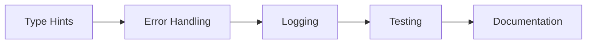
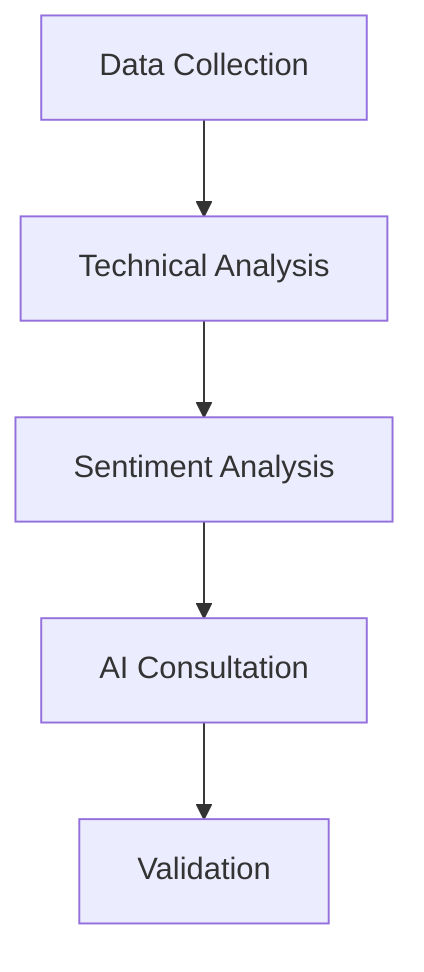
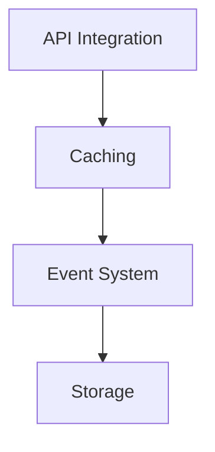

# Active Context: QSBets

## Current Focus Areas

### 1. SEC Filing Analysis
- Developing dedicated workflow for 10Q/10K analysis
- Enhancing SEC filing understanding
- Structuring financial data extraction

### 2. Sentiment Analysis
- Improving Reddit-based sentiment analysis
- Developing custom sentiment analysis
- Filtering noise from social signals

### 3. Technical Analysis
- Enhancing indicator interpretation
- Optimizing strategy generation
- Improving backtesting accuracy

## Recent Changes & Decisions

### 1. Architecture Improvements
- Implemented event-driven analysis system
- Added technical indicator interpretation
- Enhanced token efficiency
- Structured input format changed to YAML

### 2. Analysis Enhancements
- Added better technical indicators
- Improved strategy formulation
- Enhanced macroeconomic context
- Implemented proper backtesting

### 3. Infrastructure Updates
- Added logging for failed operations
- Improved error tracking
- Enhanced debugging capabilities
- Optimized resource usage

## Active Development Patterns

### 1. Code Quality Focus

### 2. Analysis Pipeline Evolution

### 3. Integration Strategy

## Current Learnings

### 1. Technical Insights
- Token optimization techniques
- Event-driven performance patterns
- Async processing strategies
- Cache utilization approaches

### 2. Analysis Insights
- Technical indicator reliability
- Sentiment correlation patterns
- Market context importance
- Strategy validation methods

### 3. System Insights
- Event system scalability
- Resource management patterns
- Error handling strategies
- Performance optimization

## Next Steps

### 1. Priority Tasks
- [ ] Complete SEC filing analysis workflow
- [ ] Enhance competitive analysis
- [ ] Improve sentiment analysis
- [ ] Optimize token usage
- [ ] Enhance backtesting

### 2. Technical Improvements
- [ ] Enhanced error recovery
- [ ] Better resource management
- [ ] Improved caching strategies
- [ ] Optimized event processing

### 3. Analysis Enhancements
- [ ] More technical indicators
- [ ] Better strategy validation
- [ ] Enhanced context integration
- [ ] Improved result quality

## Important Patterns & Preferences

### 1. Code Organization
- Clear module separation
- Event-driven architecture
- Strong typing usage
- Comprehensive logging

### 2. Data Management
- Structured formats (YAML/JSON)
- Efficient caching
- Clear data flow
- Reliable persistence

### 3. Analysis Approach
- Multi-source validation
- Quality thresholds
- Clear reasoning
- Comprehensive testing

## Active Decisions

### 1. Architecture
- Event-driven core
- Async processing
- Modular design
- Clear separation

### 2. Technology
- Python 3.12+ requirement
- Multiple LLM support
- UV package management
- SQLite storage

### 3. Process
- Quality-first approach
- Comprehensive testing
- Clear documentation
- Iterative improvement
