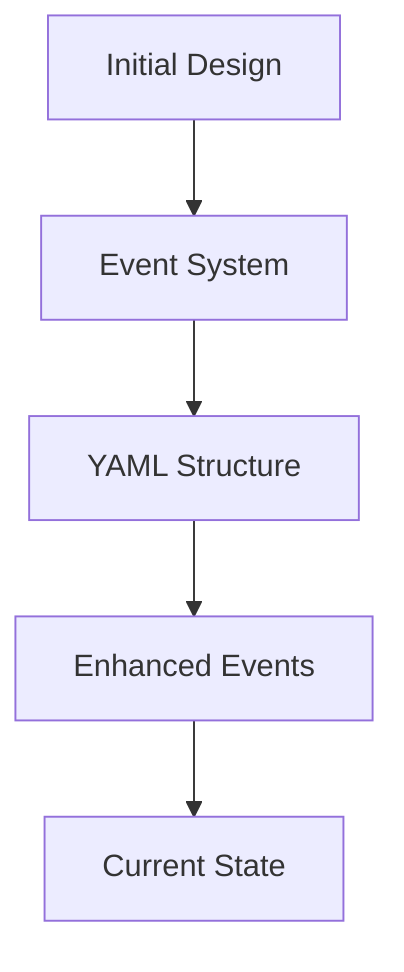
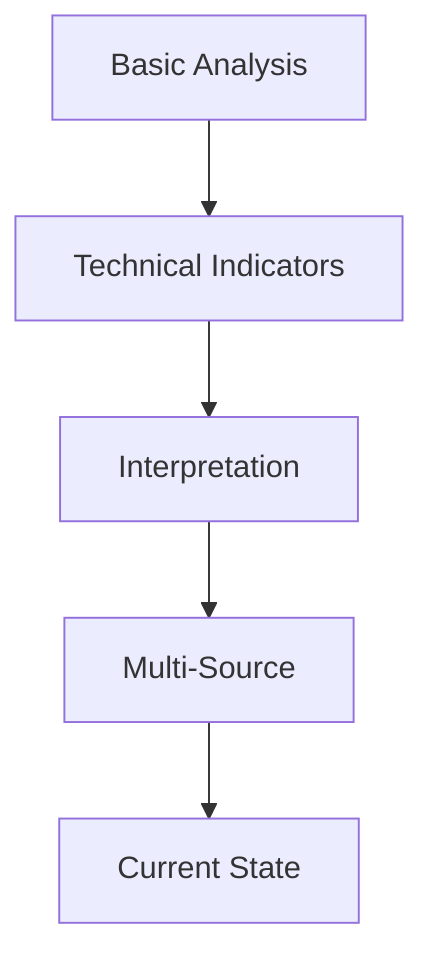
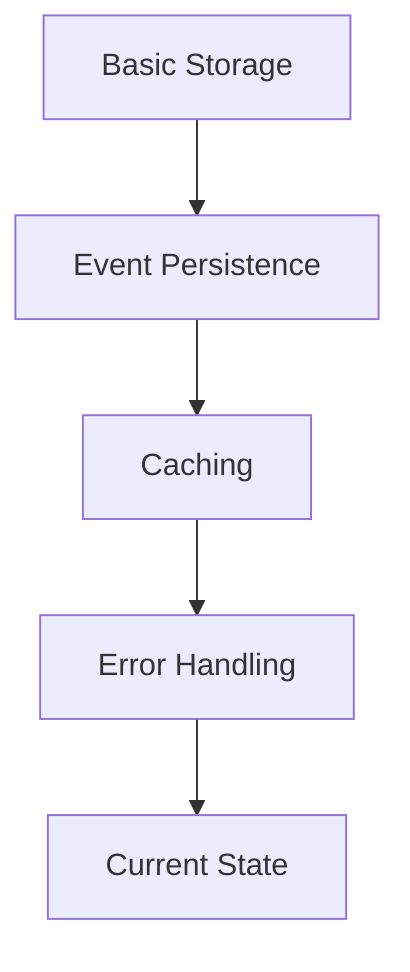

# Project Progress: QSBets

## Completed Features

### 1. Core Architecture ✓
- [x] Event-driven system
- [x] Multi-threaded processing
- [x] Telegram integration
- [x] Dashboard implementation
- [x] Backtesting system

### 2. Analysis Capabilities ✓
- [x] Technical indicator analysis
- [x] Indicator interpretation
- [x] Basic sentiment analysis
- [x] Initial API integration
- [x] YAML-based analysis reports

### 3. Infrastructure ✓
- [x] Event persistence
- [x] Results storage
- [x] Error logging
- [x] Resource management
- [x] Cache implementation

## Work In Progress

### 1. SEC Filing Analysis 🔄
**Status**: Actively developing
- [x] Basic filing retrieval
- [x] Initial parsing
- [ ] Comprehensive analysis
- [ ] Data structuring
- [ ] Integration with main flow

### 2. Sentiment Analysis 🔄
**Status**: Partially implemented
- [x] Reddit API integration
- [x] Basic sentiment flow
- [ ] Custom sentiment analysis
- [ ] Noise filtering
- [ ] Enhanced accuracy

### 3. Technical Analysis 🔄
**Status**: Core complete, enhancements ongoing
- [x] Basic indicators
- [x] Interpretation system
- [ ] Advanced patterns
- [ ] Strategy refinement
- [ ] Enhanced backtesting

## Pending Development

### 1. Competitive Analysis
**Status**: Not started
- [ ] Industry analysis
- [ ] Competitor tracking
- [ ] Market position
- [ ] Competitive advantages
- [ ] Industry trends

### 2. Enhanced Features
**Status**: Planning phase
- [ ] Advanced news integration
- [ ] Industry-specific analysis
- [ ] Enhanced visualization
- [ ] Performance optimization
- [ ] Extended backtesting

## Evolution of Decisions

### 1. Architecture Changes

### 2. Analysis Evolution

### 3. Infrastructure Progress

## Known Issues

### 1. Technical Debt
- Some error handling needs improvement
- Cache optimization required
- Resource management refinement
- Performance optimization needed

### 2. Feature Gaps
- Limited competitive analysis
- Basic sentiment analysis
- Incomplete SEC analysis
- Basic strategy validation

### 3. Infrastructure Needs
- Enhanced error recovery
- Better resource utilization
- Improved caching
- Performance monitoring

## Success Metrics

### 1. Completed Goals
- Event-driven architecture
- Technical analysis system
- Basic sentiment analysis
- Telegram integration
- Dashboard implementation
- Backtesting system

### 2. Quality Metrics
- High-quality recommendations
- Reliable event processing
- Efficient resource usage
- Accurate analysis
- Stable operation

### 3. Ongoing Improvements
- Enhanced analysis
- Better strategies
- Improved accuracy
- Refined processes
- Optimized performance

## Future Development Path

### 1. Near-term Goals
1. Complete SEC analysis workflow
2. Enhance sentiment analysis
3. Improve technical indicators
4. Optimize performance
5. Enhance backtesting

### 2. Mid-term Goals
1. Implement competitive analysis
2. Advanced news integration
3. Enhanced visualization
4. Performance optimization
5. Extended features

### 3. Long-term Vision
1. Comprehensive analysis system
2. Advanced AI integration
3. Enhanced automation
4. Improved accuracy
5. Expanded capabilities
