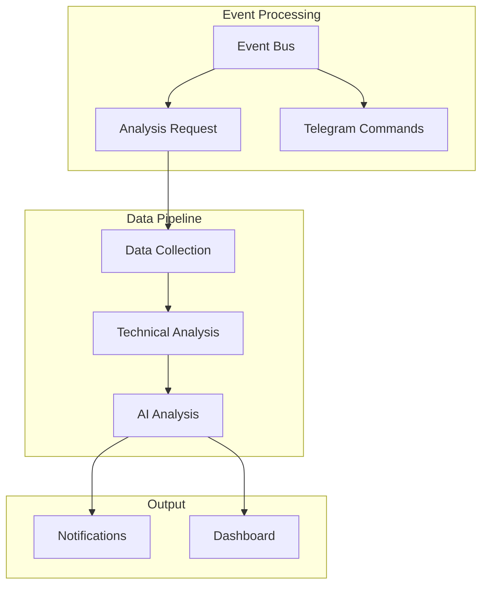
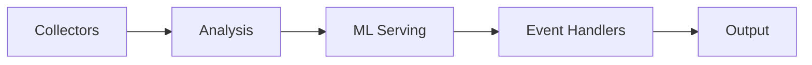
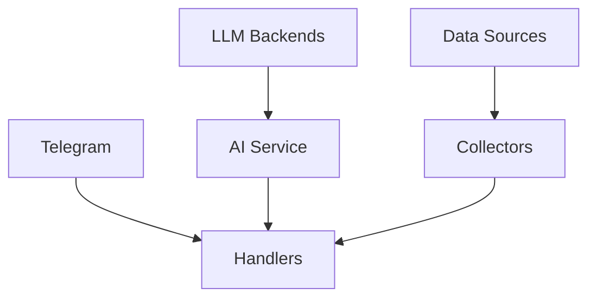

# System Patterns: QSBets

## Architecture Overview


## Core Design Patterns

### 1. Event-Driven Architecture
- **Singleton Event Bus**
  - Thread-safe implementation
  - Async event processing
  - Optional event persistence
  - Support for sync/async handlers

- **Event Types**
  ```python
  STOCK_REQUEST
  ANALYSIS_COMPLETE
  TELEGRAM_MESSAGE
  TELEGRAM_COMMAND
  ```

- **Event Flow**
  1. Event publication (thread-safe)
  2. Queue-based processing
  3. Handler execution (async/sync)
  4. Optional persistence

### 2. Data Pipeline
- **Collection Layer**
  - Stock data collection
  - News aggregation
  - Social media sentiment
  - SEC filing analysis

- **Analysis Layer**
  - Technical indicators
  - Sentiment analysis
  - Macroeconomic context
  - AI-powered consultation

- **Output Layer**
  - Telegram notifications
  - Dashboard visualization
  - Results persistence

### 3. Component Isolation


## Implementation Patterns

### 1. Asynchronous Processing
- Event loop-based architecture
- Background task processing
- Non-blocking operations
- Queue-based event handling

### 2. Data Flow
- YAML-based analysis reports
- JSON-based results storage
- Event-driven updates
- Cache-friendly design

### 3. Service Integration
- Multiple LLM backend support
- Telegram bot integration
- Technical analysis libraries
- Data source APIs

## Technical Decisions

### 1. Language & Runtime
- Python 3.12+
- Async/await pattern usage
- Thread-safe implementations
- Type hints throughout codebase

### 2. Storage Patterns
- File-based event persistence
- YAML analysis reports
- JSONL results storage
- SQLite for recommendations

### 3. Processing Model
- Event-driven core
- Multi-threaded execution
- Async event processing
- Background task handling

### 4. Integration Points


## Critical Implementation Paths

### 1. Analysis Flow
1. Stock request event
2. Data collection
3. Technical analysis
4. AI consultation
5. Result processing

### 2. Event Processing
1. Event publication
2. Queue management
3. Handler execution
4. Result propagation

### 3. Results Pipeline
1. Analysis completion
2. Quality filtering
3. Notification dispatch
4. Storage updates

## Quality Assurance

### 1. Error Handling
- Exception capture in event handlers
- Async error management
- Graceful degradation
- Logging and monitoring

### 2. Data Validation
- Input validation
- Result quality checks
- Threshold-based filtering
- Backtesting verification

### 3. System Health
- Event persistence
- Clean shutdown support
- Resource management
- Error recovery
