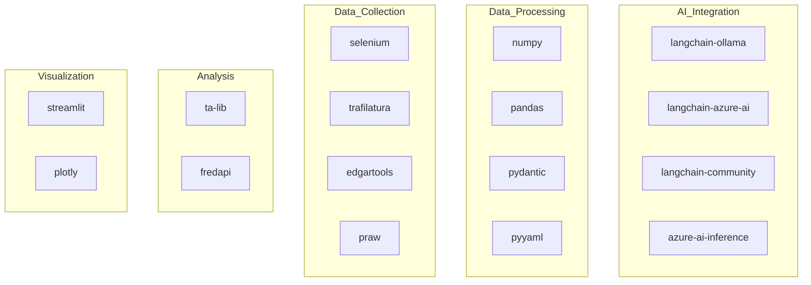

# Technical Context: QSBets

## Development Environment

### Core Requirements
- Python 3.12+ (< 3.14)
- UV Package Manager
- Virtual Environment
- TA-Lib C Library (macOS: `brew install ta-lib`)

### LLM Backend Options
- Azure AI
- Ollama
- LM-Studio
- Other Langchain-supported backends

### Dependencies Overview


## Key Technologies

### 1. Core Technologies
- **UV Tool**: Modern Python package manager
- **TA-Lib**: Technical analysis library
- **Pydantic**: Data validation
- **Pandas/Numpy**: Data processing
- **Streamlit**: Dashboard UI
- **SQLite**: Results storage

### 2. AI & ML
- **Langchain**: LLM integration framework
- **Azure AI**: Primary LLM option
- **Ollama**: Local LLM option
- **LM-Studio**: Alternative LLM platform

### 3. Data Collection
- **Selenium**: Web scraping
- **Trafilatura**: Content extraction
- **Edgartools**: SEC filing analysis
- **PRAW**: Reddit API client
- **FredAPI**: Economic data

### 4. Visualization
- **Streamlit**: Web interface
- **Plotly**: Interactive charts

## Development Setup

### 1. Environment Setup
```sh
# Install UV
brew install uv  # macOS
curl -LsSf https://astral.sh/uv/install.sh | sh  # Linux

# Install TA-Lib
brew install ta-lib  # macOS

# Setup Virtual Environment
uv sync --all-extras --prerelease=allow
source venv/bin/activate  # Unix
venv\\Scripts\\activate   # Windows
```

### 2. Configuration
**.env File Structure:**
```env
# API Keys
BING_API_KEY=key
OPENAI_API_KEY=key
OPENAI_API_BASE=url
OPENAI_API_VERSION=version
DEPLOYMENT_NAME=name

# AI Services
AZURE_INFERENCE_CREDENTIAL=key
DEEPSEEK_API_BASE=url

# Telegram
TELEGRAM_BOT_TOKEN=token
TELEGRAM_CHAT_ID=id
```

## Technical Constraints

### 1. Dependencies
- Python version compatibility (3.12-3.13)
- TA-Lib C library requirement
- LLM backend availability
- API key requirements

### 2. Performance
- Async event processing
- Thread-safe operations
- Resource management
- Cache utilization

### 3. Storage
- Event persistence (.events/)
- Analysis reports (analysis_docs/)
- Results (results/)
- SQLite database (recommendations.db)

## Development Patterns

### 1. Code Organization
```
src/
├── analysis/      # Analysis modules
├── collectors/    # Data collection
├── event_driven/  # Event system
├── ml_serving/    # AI services
├── search/        # Search utilities
└── storage/       # Data persistence
```

### 2. Testing
- Pytest framework
- Async test support
- Backtesting tools
- Test data fixtures

### 3. Quality Tools
- Type hints
- Async patterns
- Error handling
- Logging system

## Integration Patterns

### 1. API Integration
- RESTful APIs
- WebSocket connections
- Database access
- File system operations

### 2. Service Communication
- Event-driven
- Queue-based
- Async operations
- Error resilient

### 3. Data Flow
- Collect -> Analyze -> Consult -> Notify
- Cache-friendly operations
- Structured data formats
- Persistent storage

## Deployment Considerations

### 1. Environment
- Virtual environment isolation
- Dependency management
- Configuration handling
- Resource allocation

### 2. Operation
- Daemon mode support
- Graceful shutdown
- Error recovery
- Resource cleanup

### 3. Monitoring
- Logging system
- Error tracking
- Performance metrics
- Health checks
